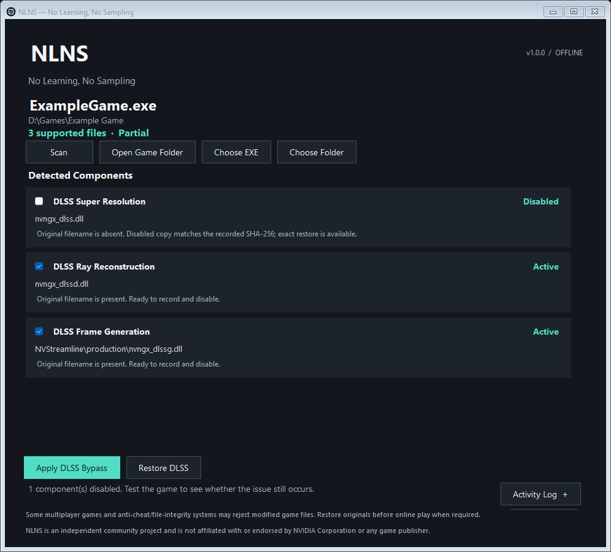

# NLNS — No Learning, No Sampling

**v1.0.0 · A lightweight, reversible DLSS compatibility troubleshooter for Windows.**

NLNS helps troubleshoot games that crash, hang, or fail to launch when local DLSS components, DLSS injection tools, or graphics-mod setups cause compatibility conflicts.

Instead of deleting or replacing files, NLNS temporarily disables supported DLSS components by renaming them, records their original state, and allows them to be safely restored afterward with SHA-256 verification.

The goal is simple:

**Select → Scan → Apply DLSS Bypass → Test → Restore**

## Why NLNS exists

Modern games may load NVIDIA DLSS components during graphics initialization. In some configurations, conflicts involving DLSS DLLs, injected graphics tools, mods, overlays, or other rendering components can prevent a game from starting correctly.

Manually troubleshooting this often means finding several DLLs scattered throughout a game directory, renaming them individually, remembering where they came from, and later restoring everything correctly.

NLNS automates that process while keeping it reversible.

It does **not** install replacement DLSS libraries, modify NVIDIA drivers, or permanently alter the game.

## How to use

1. Run `NLNS.exe`.
2. Choose the game's executable or installation folder.
3. NLNS recursively scans the selected game directory for supported DLSS components.
4. Active components are selected by default.
5. Click **Apply DLSS Bypass**.
6. Launch the game normally and test whether the issue still occurs.
7. Close the game.
8. Click **Restore DLSS** to restore the recorded originals.

Individual components can be unchecked before applying the bypass if you want to test them selectively.

Use **Scan** again after game updates or other external changes.

The **Activity Log** provides additional information about detected files and operations.

> Some multiplayer games and anti-cheat or file-integrity systems may reject modified game files. Restore the original files before online play whenever required.

## Supported components

| Filename | Component |
| --- | --- |
| `nvngx_dlss.dll` | DLSS Super Resolution |
| `nvngx_dlssg.dll` | DLSS Frame Generation |
| `nvngx_dlssd.dll` | DLSS Ray Reconstruction |

Detection is based on the exact filename and does not make any claim about the origin, authenticity, or version of a DLL.

NLNS never loads or executes the detected DLLs.

## Recursive scanning

DLSS components are not always located beside the main game executable.

NLNS scans recursively through the selected game directory, including nested locations such as:

```text
NVStreamline\production
```

Each physical file path is tracked independently.

Known backup folders, NLNS state folders, redirected filesystem entries, and inappropriate system locations are excluded from scanning.

## Reversible disabling

NLNS does not delete DLSS files.

When a component is disabled, it is renamed beside the original location using the suffix:

```text
.nlns-disabled
```

For example:

```text
nvngx_dlss.dll
```

becomes:

```text
nvngx_dlss.dll.nlns-disabled
```

NLNS records the original file information before making the change.

No replacement DLL is installed.

## Restoration and verification

NLNS stores state information in a small manifest inside the selected game directory.

The manifest records information such as:

- Relative file path
- Original file size
- SHA-256 hash
- Recorded component state

When restoring files, NLNS verifies the recorded data before restoring the original filename.

This helps prevent a changed or unexpected file from silently being treated as the original baseline.

NLNS uses explicit states including:

- **Active**
- **Disabled**
- **Partial**
- **Conflict**
- **Missing**
- **Unknown**

If the state of a file cannot be safely determined, NLNS does not guess or overwrite it.

## Interrupted operations

If NLNS or Windows is interrupted during an operation, run NLNS again and rescan the same game directory.

Verified original files appear as **Active**.

Verified renamed files appear as **Disabled**.

A mixture of original and renamed files may appear as **Partial**.

Files that cannot be safely reconciled are shown as **Conflict**, **Missing**, or **Unknown** and require manual review.

## Legacy restoration support

NLNS can recognize validated manifests created by the earlier DLSS Bypass utility using:

```text
.dlss-bypass\manifest.json
```

Legacy disabled files are only restored automatically when their recorded manifest information can be verified.

An old renamed file without a valid manifest is treated as **Unknown**.

## Safety protections

NLNS includes protections intended to reduce the chance of accidental file loss or incorrect restoration.

These include:

- SHA-256 verification
- No-overwrite file renaming
- Persisted original hashes
- Explicit conflict states
- Path validation
- Manifest validation
- Hardlink refusal
- Reparse/link protection
- Operation locking
- Process checks
- Recovery-aware state tracking

NLNS does not automatically terminate game processes and does not automatically request administrator privileges.

If Windows reports access denied for a protected game directory, close NLNS and use **Run as administrator** only when required.

## Privacy

NLNS is fully offline.

It does not include:

- Telemetry
- Analytics
- User accounts
- Advertising
- Background services
- Startup tasks
- Automatic update services
- Required network connections

Logs remain in memory unless you choose to copy them.

## What NLNS does not do

NLNS does **not**:

- Download replacement DLSS libraries
- Modify NVIDIA drivers
- Modify system NVIDIA files
- Inject code into games
- Automatically launch games
- Terminate game processes
- Modify global graphics settings
- Bypass DRM
- Bypass anti-cheat
- Prove that DLSS is definitively responsible for a crash

NLNS is a troubleshooting tool. Its purpose is to make one specific compatibility test fast, repeatable, and reversible.

## Requirements

- Windows 10 or Windows 11
- .NET Framework 4.8 or later

NLNS is a portable Windows application and does not require installation.

## Screenshot



## Known limitations

- NLNS is intended for local game directories.
- Network shares and redirected filesystem locations are not supported.
- Some games may refuse to start when a required DLL is absent.
- Game updates may replace or modify previously recorded files.
- Restore files before updating a game whenever possible.
- If a recorded file changes, NLNS may report a conflict instead of automatically restoring it.
- Launchers may start additional executables that NLNS cannot always detect in advance.
- Files manually renamed outside NLNS without a valid manifest may not be automatically recoverable.
- Interrupted-operation recovery is designed for practical filesystem safety but cannot protect against disk failure, deleted files, malicious concurrent modification, or hardware failure.
- The current executable is unsigned.
- Windows may therefore display a SmartScreen warning when running the application for the first time.

## Current release

**NLNS v1.0.0**

The initial release includes:

- Recursive DLSS component detection
- One-click **Apply DLSS Bypass**
- One-click **Restore DLSS**
- Active components selected by default
- Individual component selection
- SHA-256 verified restoration
- Persistent recovery state
- Legacy manifest support
- Explicit conflict and recovery states
- Offline operation
- Portable Windows executable

## License

NLNS is licensed under the [MIT License](LICENSE).

NLNS is an independent community project and is not affiliated with or endorsed by NVIDIA Corporation or any game publisher.
